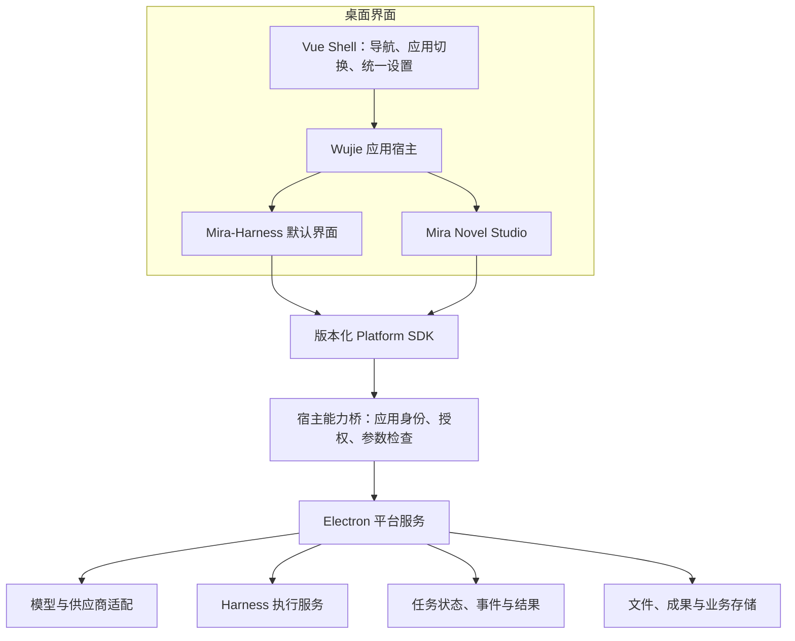

# Mira 产品定位、架构拆分与应用分发方案

> 日期：2026-09-23  
> 状态：第一阶段范围已收敛，供后续实施使用；不代表迁移、React 重构或应用安装器已经实现。  
> 原代码基线：`core-platform` 仓库的 `desktop-dev` 分支；当前方案更新于 `codex/mira-harness-first-slice`。
> 产品范围：Electron 桌面端，当前不规划移动端。  
> 阅读建议：先看第 1–4 节理解产品和项目关系，再看第 6 节理解设置边界，最后按第 13 节安排开发。

## 1. 产品定位：我们到底要做什么

Mira 是以 Harness 为核心、可扩展专业应用的个人 AI 桌面工作台。

用户安装一个 Mira 桌面客户端，默认进入 Mira-Harness，用自然语言完成研究、文件处理、写作、编程和自动化任务。第一阶段交付 Mira-Harness，并在外部 Mira Novel Studio 项目就绪后完成其接入；Mira Vision 暂不开发。本仓库最终只保存 Novel Studio 与 Vision 的平台接入配置，不承载两个应用的业务工程。应用共享必要的平台能力，保留各自适合的操作界面。

产品包含三个不同含义，后续讨论必须明确所指：

| 名称 | 含义 | 例子 |
| --- | --- | --- |
| Mira 桌面平台 | Electron、基础布局、应用宿主、设置和公共服务 | 窗口、应用安装、昼夜主题、模型连接 |
| Harness 执行能力 | 完成 Agent 任务所需的运行时能力 | 工具循环、审批、计划、取消、运行记录 |
| Mira-Harness 默认应用 | 用户操作 Agent 的主要界面 | 会话、输入区、执行过程、文件变更、成果预览 |

Harness 是产品主体，但其执行能力与聊天页面需要解耦。其他应用不应依赖“聊天页必须打开”才能调用 AI，也不必把所有业务操作都转换成一段聊天。

例如：小说应用点击“续写本章”，可以直接调用模型服务；执行“检查全书人物一致性并生成报告”，可以调用 Harness 任务。未来 Vision 也可以复用这些平台能力，但不属于当前实施范围。

### 1.1 已明确的用户方向

- Electron 提供桌面能力。
- Vue + Wujie 承担基础布局和子应用承载。
- Mira-Harness 是默认应用与产品核心入口。
- 界面分为前台工作应用和统一设置区。
- 本仓库只开发 Mira-Harness、桌面平台和应用接入能力；Mira Novel Studio 的业务工程独立维护，第一阶段完成接入。
- Mira Vision 在本仓库只保留未启用的接入配置，不创建业务目录或开发功能；项目以后单独建 Git 仓库。
- 应用由平台清单管理，不开放用户自由录入微应用。
- 设置只维护白天 / 黑夜，不开放布局、主题色和加载样式配置。
- 删除当前无实际价值的菜单管理和多页签能力。
- Harness 前端可以评估 React 重构，也可以评估基于开源项目二次开发。
- Electron 集中职责需要解耦，按启动、接口、业务、持久化和外部适配组织代码。
- 现有 Novel Studio 业务后续迁出并单独建立 Git 仓库；Vision 未来直接建独立 Git 仓库。这里最终仅保留受控应用清单、入口、版本和能力等必要接入配置，不再提交两者的业务源码或构建工程。
- 重新设计统一设置页，管理基础能力、平台能力和应用模型能力。
- 本次先更新方案文档，物理迁出、配置落地和删除旧代码另按验收关口实施。

### 1.2 本文提出、尚未正式采用的建议

- 第一期仅分发受信任的第一方静态前端包；新增原生能力随桌面客户端升级。
- 默认 Harness 随安装包内置，确保首次启动及离线时有可用界面。
- 先验证 Mira Novel Studio 的接口与生命周期，再完成应用中心和远程下载。
- React 先做一条完整任务流程的验证，不以重写数量作为目标。

上述仓库归属已明确，物理迁出时间和具体接入协议仍须评审。创建新仓库、改名、删除旧页面、迁移数据和替换运行时，均不由本文自动触发。

## 2. 为什么目前容易陷入“既要又要”

当前同时涉及桌面平台、Agent 运行时、Harness 产品界面和小说业务应用。它们各自都可以发展成完整项目，因此第一阶段必须限制范围。

一旦把“平台第一版完成”定义成“Harness 的每项高级能力都达到成熟竞品水平”，后续应用就会一直等待。反过来，如果只做多个网页的切换，而缺少共享能力与任务连续性，也无法形成统一产品。

因此，第一阶段的完成标准应是：

> 默认 Harness 的核心任务流程稳定；Mira Novel Studio 能够通过明确的平台接口调用模型、保存业务数据、查看任务结果；切换应用不会丢任务或草稿。

这不要求立即具备完整 IDE、任意第三方插件市场、云同步、Mira Vision 或复杂多 Agent 编排。

## 3. 当前代码已经具备什么

以下是本次对源码的核对结果，不等同于桌面运行验收。

| 能力 | 当前状态 | 代码入口 |
| --- | --- | --- |
| Electron 主进程与 IPC | 已有，业务接口集中度仍较高 | `electron/main.ts`、`electron/preload.ts` |
| Vue 前台与设置区 | 已有独立路由和布局 | `src/layouts/`、`src/pages/backend/settings/` |
| 应用切换与微应用配置 | 已有注册、启停、菜单和切换入口；自由录入模式准备退出 | `src/config/runtime.ts`、`src/pages/backend/microAppManagement/` |
| Wujie 宿主 | 已有加载、导航、保活和预加载配置 | `src/pages/frontend/microAppHost/index.vue` |
| 子应用上下文 | 当前主要是主题、语言、用户信息和导航 | `PlatformContext`、宿主 `childProps` |
| 本地资源加载 | 已有回环 HTTP 静态服务，可服务构建目录 | `electron/localMicroAppServer.ts` |
| 内置应用包 | 类型和服务支持已有；默认内置资源包清单为空 | `src/config/microApps.ts` |
| 开发 URL | 类型层有 URL，但当前配置校验只允许 Wujie 使用本地目录或内置包 | `src/config/platformValidation.ts` |
| Harness 运行时 | 已有主进程运行、权限、计划、子任务、记忆等职责拆分 | `electron/harnessRuntime.ts` 及协调器 |
| 小说业务 | 已有 Vue 页面、主进程 API 和存储，仍属于当前桌面项目 | `src/pages/frontend/aiNovel/`、`electron/novelStore.ts` |
| 应用下载和版本安装 | 尚未形成受管理应用包机制 | 需要新增官方应用目录、安装记录和版本切换 |
| 公共 Platform SDK | 尚未建立完整的版本化应用接口 | 需要从现有 IPC 中逐步抽取 |

结论：已有基础可以继续演进。当前重点是收缩无用平台入口、补齐第一方应用契约和生命周期，不是从零重做壳。

另外，`PRODUCT.md` 仍主要描述小说创作，与本次明确的平台定位不一致；现有 Harness 路线图也包含不同阶段的描述。后续采用方案时应单独同步这些文件，不能把旧文档中的完成标记当成新架构已经落地。

## 4. 仓库边界：主仓库只承载平台与 Harness

三个业务名称不意味着只能有三个内部模块。仓库边界、代码模块边界和发布产物边界是三件事。

### 4.1 目标归属

| 项目归属 | 承担内容 | 本仓库保留内容 |
| --- | --- | --- |
| 当前 `core-platform`，后续可命名 `mira-harness` | 桌面平台、Vue 壳与设置、公共服务、默认 Harness UI、SDK | 平台与 Harness 源码；两款外部应用的接入配置 |
| 后续独立 Git 项目 `mira-novel-studio` | 小说界面、领域逻辑、应用端业务代码，独立构建与发布静态包 | 受控应用清单、版本/能力约束和开发联调入口；不保留小说应用工程 |
| 后续独立 Git 项目 `mira-vision` | 暂不开发；启动时间另定 | 未启用的接入配置；不创建业务目录、不进入应用列表或发布流程 |

现有 `src/pages/frontend/aiNovel/`、`electron/novelApi.ts`、`electron/novelStore.ts` 仍在当前仓库，是迁出前的历史实现，并非目标结构已达成。迁出时先确定作品数据的唯一所有者及 SDK/存储边界，在独立项目跑通构建、旧作品读取和回退后，才移除这里的小说业务实现；不能直接删除旧代码或用户数据。此时不创建两个新仓库，也不在本仓库嵌套它们的 Git 工程。

主仓库内部的目标结构可参考下图。它是规划示意，不要求第一步就完成所有目录迁移。

```text
mira-harness/
├── apps/
│   ├── desktop/          # Electron 生命周期、IPC、服务装配、安装更新
│   ├── shell/            # Vue 布局、导航、应用切换、统一设置
│   └── harness-ui/       # 默认 Harness 页面；React 为候选
├── packages/
│   ├── platform-contracts/ # 纯 TypeScript 接口、事件、错误码
│   ├── platform-sdk/       # 子应用调用适配、订阅与释放
│   ├── agent-runtime/      # Agent 执行能力，桌面侧构建
│   └── design-tokens/      # 跨 Vue / React 的颜色、字体、间距、状态
├── config/first-party-apps/ # Novel Studio 接入配置；Vision 仅预留、禁用
└── docs/
```

Novel Studio 通过固定版本的 SDK 依赖平台，不引用主仓库的 Pinia、Vue 组件或 Electron 内部文件。开发时可以用本地包链接，发布时必须使用可复现的版本依赖。Vision 进入开发后再遵循这一契约，目前不安装 SDK 或其他依赖。

### 4.2 什么时候再拆独立 Shell 仓库

当桌面平台有独立维护者、需要服务多个发行版，或默认 Harness 的发布节奏确实妨碍平台升级时，再考虑独立的 `mira-shell` / `mira-desktop` 仓库。

当前再拆 Shell 会增加跨仓库联调、依赖发布和版本配套成本。平台职责应立即明确，Shell 是否独立可稍后决定。

## 5. 运行架构与职责边界



这是第一阶段目标逻辑分层，不要求每个方框立即拆成进程或独立 npm 包。Vision 仅有未启用的接入配置，不接入运行架构。

### 5.1 Electron 与平台服务

负责窗口、原生菜单、桌面通知、文件访问、凭据使用、运行服务、应用安装和更新。耗时或可能阻塞的执行应放入适合的 worker / 子进程，主进程负责协调，不把视频处理等计算直接塞进事件循环。

模型连接统一管理，当前只实现 Harness 与 Novel Studio 实际需要的模型能力。图片、音频和视频生成适配留待 Vision 阶段，不提前建设。

Electron 高度集中的代码按职责解耦。目录组织建议如下，具体路径在实施前确定：

```text
electron/                 # 未来可迁入 apps/desktop/src/
├── bootstrap/            # 启动、窗口和生命周期装配
├── ipc/                  # 通道注册、参数校验、业务服务调用
├── services/             # Agent、模型、任务、应用安装等业务服务
├── storage/              # SQLite、配置文件与持久化
├── adapters/             # 供应商、MCP、Git、Python 等外部适配
└── security/             # 权限、路径与应用包检查
```

入口只负责装配，IPC 不堆积业务实现，业务服务不依赖具体页面。按实际依赖逐块迁移，不为目录整齐创建空服务或重复包装。第 4 节的 `agent-runtime` 若抽成独立模块，应由服务调用，不能在两处重复实现。

### 5.2 Vue Shell

负责全局导航、应用选择、窗口操作、昼夜主题、公共设置和任务入口。默认进入 Harness，并允许切换到已安装的第一方应用。

壳不重复渲染子应用的编辑器工具栏、会话列表或图库。可以由子应用声明导航项，由壳绘制公共导航区域，避免出现双侧栏、双顶栏。

### 5.3 子应用

负责本领域的界面、业务流程和校验。小说的作品和章节由独立 Novel Studio 项目维护应用端模型，宿主通过受控接口提供必要存储；Harness 的会话与计划仍由主项目维护。Vision 当前不开发数据模型或运行时接入。

应用之间通过明确的成果引用或平台操作协作，不直接读写彼此的数据表，也不共享全局前端状态容器。

### 5.4 Wujie 的边界

Wujie 提供多框架界面承载、样式与运行环境适配、导航和生命周期衔接。它不是应用包安装器，也不是后台任务调度器。

Wujie 的沙箱不能视为针对恶意第三方代码的强安全隔离。产品收敛为平台清单管理的第一方应用，不开放用户自由添加目录、URL 或第三方代码。开发入口仅供本机联调，不出现在正式应用设置中；Wujie、iframe 和资源前缀等实现参数不再作为普通用户配置。

## 6. 前台与设置：入口统一，职责分开

“后台设置”在这里是本地桌面产品的配置区域，不意味着需要新增云端管理后台。

| 设置层级 | 归属 | 示例 |
| --- | --- | --- |
| 基础设置 | Shell | 白天 / 黑夜、必要快捷键、通知、数据与备份 |
| 平台能力 | 平台服务，Shell 提供 UI | 权限、MCP、现有 Git / Python 环境配置 |
| 模型与应用模型能力 | 平台服务，Shell 提供 UI | 供应商连接、模型列表、Harness 与小说的模型绑定 |
| 应用中心 | Shell | 第一方应用下载、安装、更新、版本与启停 |
| 应用专属设置 | 由应用提供，挂入统一设置入口 | Harness 行为、小说默认生成参数 |
| 关于与更新 | Shell | 桌面版本、检查更新、诊断信息 |
| 项目与作品设置 | 应用工作区 | 当前作品设定、项目规则、生成任务参数 |

全新设置页按上述职责设计，而不是继续叠加旧后台模板页面。“微应用管理”改为“应用中心”，只展示平台批准并已发布的应用。现有“选择应用”只负责切换，下载与版本管理放在应用中心。Vision 的预留配置必须保持禁用，不出现在当前应用列表、设置项或下载清单中。

供应商连接、模型能力与应用默认绑定分开管理：连接保存认证信息，模型描述实际能力，应用按职责选择默认模型。具体供应商数据结构和迁移方案仍待设计，不把讨论方向当成当前实现。

任务列表、自动化运行记录、文件和作品属于前台工作内容；设置页只承载它们必要的配置，不另外建设一套重复的任务与成果页面。第一阶段不新增 Vision 设置、媒体能力路由或 FFmpeg 管理页。

跨应用统一主题 token、字号层级、图标规范、操作反馈和窗口行为，不要求 Vue 与 React 共用同一套组件源码。第一阶段只保留白天 / 黑夜主题，不再维护布局样式、主题色、加载动效、图标库和多页签样式配置。

以下当前设置能力退出产品范围：

- 工作区布局样式、侧栏样式、圆角、组件尺寸等布局外观选择；
- 主题色预设和自定义主题色；
- 加载效果选择；
- 图标库管理；
- 菜单树管理和用户自定义菜单；
- 多页签开关、页签样式、页签排序与页签右键管理。

这些选项在实施时应连同专用路由、状态存储、无用布局分支和失去用途的依赖一起清理，不能只隐藏入口。昼夜主题继续保留，配色、圆角和组件尺寸由内部设计规范固定维护；不新增其他外观偏好。

删除边界：

- “菜单功能”指通用菜单管理、可编辑菜单树及任意页面注册；应用切换、项目与会话导航、操作系统原生菜单继续保留。
- “多页签”指壳级路由标签栏、其缓存管理和定制选项；小说创作阶段、工作面板分类等业务切换不因此删除。
- 删除样式设置不等于删除主题 token、必要加载反馈、固定图标、侧栏收起或真实业务需要的面板操作。
- 旧偏好通过明确迁移停止生效，旧设置路由应回到有效设置入口；不能影响会话、作品和模型配置。曾注册的外部应用数据不能随菜单清理被误删，旧导航也不能继续绕过新应用清单。

## 7. React 与开源 Harness：先验证，再确定替换范围

### 7.1 React 的价值与代价

React 的优势是可利用更多 Agent UI 组件及参考实现，不是天然比 Vue 更适合做漂亮界面。

迁移 Harness UI 时，主要需要处理消息与流式渲染、输入区、计划和审批、工具事件、历史会话与面板状态。现有 Electron 服务与数据可以先通过适配层保留，但 Pinia 和 Vue composable 中的业务行为需要明确迁移，不能只翻译模板。

### 7.2 三条路线

| 路线 | 收益 | 主要成本 | 建议 |
| --- | --- | --- | --- |
| 保留 Vue，改造交互并选择 Vue AI 组件 | 改动较小，沿用当前工程 | 仍需自行设计 Harness 专用交互 | 保留为对照方案 |
| React 重构 UI，连接现有运行时 | 利用 React UI 生态，保留后端投入 | 状态适配、数据契约与交互迁移 | 优先做原型验证 |
| Fork 完整开源 Harness | 获得现成产品流程与界面 | 其后端、会话模型、权限、原生依赖可能与 Mira 冲突 | 先调查再决定，不能默认最省时 |

开源项目可作为参考：

- [assistant-ui](https://github.com/assistant-ui/assistant-ui)：React 对话组件与运行时适配候选。
- [AionUi](https://github.com/iOfficeAI/AionUi)：通用工作台与文件预览参考。
- [Goose](https://github.com/aaif-goose/goose)：工具状态与审批交互参考。
- [Harnss](https://github.com/OpenSource03/harnss)：文件变更、子任务与桌面工作区参考；本次查阅时 README 提示早期开发和较大重写计划。
- [Element Plus X](https://github.com/element-plus-x/Element-Plus-X)：Vue + Element Plus 路线的组件候选。

以上是调研入口，不是已选依赖。采用前固定上游版本，检查实际导出接口、依赖和许可证；复制代码需保留适用的版权声明及许可证信息。

### 7.3 原型必须回答的问题

1. 能否在 Vue + Wujie + Electron 内正常挂载、卸载和热更新？
2. 能否承载 Mira 的真实消息事件、计划、确认和工具结果，而不绕过大量组件逻辑？
3. 切换应用后，任务还在运行，返回时能恢复状态并且不重复订阅吗？
4. 中文输入法、快捷键、剪贴板、滚动、弹层与文件选择是否正常？
5. 相比 Vue 路线，真正减少了哪些需要维护的代码？新增了哪些运行时约束？

以“发送需求 → 工具执行 → 一次确认 → 输出文件 → 查看成果 → 重新进入会话”为最小完整原型。确认设计和复用收益后再替换生产页面。

## 8. 外部子应用如何与同一个 Electron 联调

项目独立建仓后，可在同一父目录用 IDE 多根工作区打开，但两个外部项目不能作为本仓库的子目录或子模块。当前只启动本仓库的 Electron 与独立 Novel Studio 所需的前端服务；Vision 未开发时无须创建目录、启动、构建、CI 或发布。

```text
workspace/
├── mira-harness/       # 本仓库：Electron、Vue Shell、Harness、外部应用接入配置
├── mira-novel-studio/  # 后续独立 Git 仓库：小说前端开发服务
└── mira-vision/        # 后续独立 Git 仓库：当前无须创建
```

开发环境通过专用本地配置把已批准应用的入口指向各自的开发服务；生产环境仅加载平台安装器登记的第一方资源包。开发覆盖配置仅留在本机，不把开发端口或绝对路径写进正式发布清单，也不提供用户自由注册入口。

当前 Wujie 入口校验尚不允许 URL，因此“多个 dev server 联调”需要新增明确的开发入口机制，并验证 HMR、资源路径与路由。不能因为类型里存在 `url` 就当它已经可用。

独立 Novel Studio 项目应提供：

- 开发入口与可构建的静态入口。
- 挂载、卸载、恢复逻辑，以及事件订阅清理。
- 平台 SDK 适配层；浏览器独立开发时可使用明确标注的 mock。
- 本地构建产物的资源基路径约定。

Wujie 保活只服务页面状态与切换体验。长时间的生成或 Agent 任务由宿主服务持有，不能靠“页面还没销毁”维持。也不应默认让所有重型应用永久保活，应保存草稿和视图状态后按需释放资源。

## 9. 独立 Release 与一键安装：可以实现，但分清包的类型

### 9.1 第一期推荐发布什么

子应用发布预构建的静态资源归档包，例如 `mira-novel-studio-0.1.0.zip`，内含 HTML、JS、CSS、图标及应用清单。用户端下载后无需 npm install，也不执行安装脚本。

主仓库发布 macOS / Windows 桌面安装包。默认 Harness UI 初期随桌面版本发布，稳定后可选择增加兼容的独立 UI 更新，同时保留内置回退版本。

| 修改内容 | 能否仅更新子应用包 |
| --- | --- |
| 文案、界面、前端业务流程 | 可，前提是仍符合平台接口和数据版本 |
| 使用已有模型能力增加页面 | 通常可，需通过兼容性检查 |
| 新增主进程 IPC、Agent 工具实现 | 第一期需要更新主程序 |
| 新增供应商视频协议适配 | 若现有平台不支持，需要更新平台服务 |
| 新增 SQLite 结构或原生模块 | 需要受管理的数据迁移或主程序升级 |
| 安装 Python、FFmpeg 或本地模型引擎 | 不属于普通 UI 包，单独设计依赖分发与进程管理 |

因此，独立仓库和独立 Release 不等于前后端可以无限制独立升级。第一期先把“独立更新前端”做好，不立即建设可下载任意 Node/Python 后端代码的插件系统。

### 9.2 安装与更新流程


GitHub Releases 负责托管产物，不直接承担本地安装事务。平台维护一份第一方应用目录，指向批准发布的版本，不能盲目下载每个仓库的 latest。网络不可用时，已安装应用仍可打开；云端生成是否可用取决于对应供应商连接。

### 下载应用扩展包与真正的差分更新

用户提出的“下载增量包”首先落实为：从应用中心补装平台支持的子应用，无需重新下载整套桌面客户端。这里的应用扩展包可以是完整的子应用静态资源包。

技术上的二进制差分更新是另外一项优化：首次安装下载完整应用包；更新已有版本时，如果未来提供匹配的差分包，可以优先使用，失败则回退完整包。第一阶段先完成完整子应用包的下载、校验、安装和恢复，不把差分算法设为前置条件。产品入口可使用“下载应用”“安装”“更新”，不向用户暴露包实现细节。

### 9.3 包清单与发布元数据分开

下面只是拟议字段，用于沟通设计，不是已有协议。包内清单示例：

```json
{
  "manifestVersion": 1,
  "id": "mira-novel-studio",
  "name": "Mira Novel Studio",
  "version": "0.1.0",
  "entry": "index.html",
  "minShellVersion": "0.2.0",
  "platformApi": "^1.0.0",
  "requiredCapabilities": ["models.text", "storage.novel.v1", "artifacts"],
  "requestedPermissions": ["models.invoke", "storage.own", "files.user-selected"]
}
```

SHA-256、下载 URL、包大小及签名放在外部发布元数据或签名文件中。不要把整个 ZIP 的哈希放进 ZIP 自身的 manifest，否则会形成自引用。

摘要用于确认下载内容完整；可信发布身份需要可信来源或由宿主信任的公钥验证签名。应用声明所需权限不等于自动获准，实际授权由宿主管理。新版本扩大权限时应在升级界面明确呈现。

### 9.4 本地安装与数据目录

建议由现有 `MiraPaths` 增加受管理位置，而不是直接假定 Electron 默认 userData 就是当前项目的真实数据根目录。示意：

```text
<Mira 数据根目录>/
├── apps/
│   └── mira-novel-studio/
│       ├── versions/0.1.0/   # 只读程序资源
│       └── versions/0.2.0/
├── app-staging/             # 临时下载和待激活内容
├── app-data/                # 应用业务数据，与程序版本分离
└── 平台现有配置与数据库
```

激活版本可由数据库或原子替换的注册文件管理，实施时选一种。不得把用户作品写入应用版本目录，否则升级清理可能误删数据。

安装器需要处理路径穿越、符号链接逃逸、过量解压、下载损坏和安装中断；这些属于解压执行资源包的必要正确性要求。新版本完整安装前，不覆盖正在使用的旧目录。

卸载默认保留作品、素材和历史；删除数据应是单独且明确的操作。正在使用的版本不能被直接清理，更新激活前应保存草稿、释放视图并重新挂载。运行中的后台任务继续使用其启动时确定的服务和配置。

### 9.5 回滚的限制

资源包回滚不等于数据回滚。新版本若改变业务数据格式，旧 UI 可能无法读取；不能笼统承诺所有版本都一键回滚。

第一期尽量采用向后兼容的数据变化。必须迁移时，先验证兼容范围、备份与事务恢复方案，再允许激活。独立前端包不能悄悄要求一个宿主尚不支持的新数据库结构。

## 10. Platform SDK：把现有 IPC 转成应用可依赖的契约

### 10.1 首版只定义真实需要的接口

| 接口领域 | 首批用途 | 归属边界 |
| --- | --- | --- |
| Context | 应用身份、主题、语言、API 版本、可用能力 | 应用身份由宿主绑定 |
| Models | 列出可用模型、提交适用类型请求 | 凭据由主进程使用，不下发给子应用 |
| Harness | 启动/取消 Agent 任务，读取运行状态 | 保留明确的审批与工具边界 |
| Tasks | 查询、订阅和定位所属应用 | 通用状态封装，不强制统一业务参数 |
| Artifacts | 注册、列出、预览或打开成果 | 成果关联应用、任务及实际文件 |
| Storage | 读写本应用业务对象 | 分命名空间，先适配现有小说服务 |
| Navigation | 应用内部导航、返回任务来源 | 不允许覆盖平台设置等保留路由 |

不要直接把整个 `window.platform` 传给子应用。当前 preload 中既有业务调用，也有配置与密钥相关方法；它是现有宿主界面的接口集合，不是可以原样开放的子应用 SDK。

Wujie 的共享事件总线适合导航通知，不适合广播凭据、私有文件正文或不分应用的全部任务事件。

### 10.2 长任务的最小契约

- 提交后返回 `taskId`，任务不依赖页面存活。
- 记录任务所属应用、业务对象、状态、时间及成果引用。
- 事件带任务 ID 和递增序号；重新进入时先获取快照，再从游标恢复或去重订阅。
- 创建任务支持幂等标识，避免重复点击或重试导致重复收费任务。
- 取消区分“请求取消”和“已停止”；远程视频生成是否可取消由供应商能力决定。
- 页面切换后，审批请求仍有可达入口；进入来源应用时能恢复确认状态。
- 应用重启后区分“恢复显示”“继续查询远程任务”和“恢复执行”，不把三者混为自动续跑。

已有 Harness 事件和持久化可以作为适配起点；首批先接 Harness 与小说，不一次性设计所有媒体任务的字段。

### 10.3 兼容性规则

Shell 版本、Platform API 版本和应用版本分别管理。Shell 应返回实际能力列表；仅版本号满足而必要服务未启用，也应显示“能力不可用”。

破坏性接口变更升级 API 主版本；可选字段和新增能力尽量兼容旧应用。安装前检查要求，运行时也返回明确错误，不能让子应用在白屏后才暴露不兼容。

## 11. UI 打磨如何与架构拆分同步

最初需求是让 Mira 更好看、更顺手。平台拆分不能取代这项工作，也不应让用户体验停滞到所有基础设施完成之后。

### 11.1 默认 Harness 优先打磨

1. 输入区区分常用操作与高级配置；明确当前模型、权限和执行方式。
2. 执行中、等待确认、失败、停止、完成使用一致的状态语言。
3. 消息突出正文和成果，工具详情按需展开，减少重复过程列表。
4. 工作面板从记录查看扩展到成果预览，宽度适合阅读和文件对比。
5. 运行期间允许保存下一条草稿，再评估排队与中途补充指令。
6. 历史与项目页以继续工作为中心，降低后台统计界面的视觉重量。

文件差异查看与安全撤销分开排期：撤销需要修改前快照、操作记录和后续修改冲突检测，不能仅依据显示出来的 diff 增加按钮。

### 11.2 当前两个应用共享的体验规范

- 相同的应用切换、设置返回、通知和错误反馈习惯。
- 统一白天 / 黑夜主题 token、文字层级、焦点样式及快捷键冲突规则，不开放自定义配色和布局。
- 全局任务入口能找到应用来源；任务完成后能直接打开成果。
- Harness 使用对话工作台，小说使用编辑器；Vision 的界面形态后续再设计。
- 窗口拖动区、macOS / Windows 标题栏、输入法和弹层需分别做桌面验收。

设计稿至少覆盖空态、执行中、确认、成功成果、失败恢复五种状态。先用同一套设计比较 Vue 与 React 的实现，不把设计收益误算为框架收益。

## 12. 数据与现有用户迁移

第一阶段尽量保留现有模型配置、Harness 会话与小说存储，通过服务适配暴露给独立小说应用。应用源码迁出不要求同时移动数据库或用户目录；存储暂留宿主时必须明确其只是平台受控服务，不让独立应用直接依赖 `electron/novelStore.ts` 等内部源码。作品数据迁移须另行设计并验收。

新的应用 ID 与当前 `micro-${code}` 约束、路由编码、历史偏好之间需要显式映射，不能更名后导致已安装应用或历史记录失联。

如果需要迁移：

1. 明确数据唯一所有者与迁移版本。
2. 备份或保留可恢复的旧数据；禁止前后两套 UI 无约束地双写。
3. 在事务中迁移并检查记录数量、引用关系和必要字段。
4. 中断后可重试，失败时仍能使用旧入口或恢复数据。
5. 原生应用内验证历史会话、作品正文、模型绑定与成果链接。

本地优先指本地掌握数据和配置，不代表没有网络传输。调用在线模型时，相关请求内容与认证信息仍会发送到配置的供应商；远程应用更新也依赖下载服务。产品文案应准确表达这些边界。

## 13. 分阶段实施计划与验收

以下是第一阶段内的建议工作批次，不是已批准的执行顺序。先审计现有 Electron/Harness/小说边界及开源 Harness UI 候选，再决定结构切分和 UI 路线；旧结构下的原型测试只作为摸底，不算新架构验收。“Harness 和 Novel Studio 完全跑通”以本节的核心任务、外部项目接入、切换、数据恢复与发布验收为界，不要求实现所有竞品功能。

阶段 0 的源码依赖、候选对比及第一刀建议见 [MIRA_PHASE0_AUDIT.md](./MIRA_PHASE0_AUDIT.md)；其中 React/Vue 正式选型及小说数据长期所有权仍需后续验证。

| 阶段 | 范围与交付 | 完成标准 |
| --- | --- | --- |
| 0：审计与选型 | 审计 Electron/Harness/小说依赖、数据与旧入口；调研开源 Agent UI、许可证和接入成本 | 明确目标边界、UI 路线、首批改动与回退方案；不把原型运行当成架构验收 |
| 平台收敛批次 | Electron 按职责解耦；设置重设计；清理自由注册、外观定制、菜单管理和壳级多页签 | 固定导航与昼夜主题可用，旧偏好不复活废弃功能，业务数据完整 |
| 1：定义最小契约 | 从现有 IPC 抽取所需 SDK，建立应用身份、任务与主题接口 | 一条真实任务通过应用适配层运行，关闭页面后可重新查询 |
| 2：Harness UI 验证 | 同一任务流程的设计稿与 React 原型；对照现有 Vue | 接入真实事件，审批、停止、成果与历史恢复可用；记录复用收益 |
| 3：外部 Novel Studio 接入 | 将旧小说业务迁往独立项目；本仓库仅保留配置和经评审的平台服务接口，本地静态包接入 | 同一 Electron 切换 Harness 与外部小说应用，旧作品和业务数据正确，监听无重复；再移除旧小说业务源码 |
| 4：安装与发布 | ZIP、应用清单、版本目录、兼容检查、失败恢复，再接 GitHub Release | 下载中断不破坏旧版，升级后可打开，兼容旧版可回退，卸载保留数据 |
| 最终双应用验收 | Harness 与 Novel Studio 的桌面真实任务、数据恢复、安装更新流程 | 两个应用均跑通后，第一阶段结束 |

阶段 2 与 3 可在契约稳定后部分交错，但每阶段应有独立可使用结果。不要同时进行 React 全量迁移、数据库重写、仓库拆分和安装器上线。

Vision 在本仓库仅保留未启用的接入配置，不分配开发批次、不生成业务脚手架、不接入应用中心。必须等 Harness 与 Novel Studio 验收完成，再单独讨论是否创建独立项目以及实现哪些能力。

### 13.1 首个可交付版本的范围

- 一个可安装的 Mira 桌面客户端，内置可用 Harness。
- 一个可安装的小说子应用，接入真实平台模型和已有作品存储。
- 应用切换、统一设置和基本任务恢复。
- 明确的 API 兼容范围和可恢复安装流程。
- 全新统一设置页，外观仅白天 / 黑夜；无自由微应用注册、菜单编辑或壳级路由多页签。
- Vision 只留禁用的接入配置，应用、设置和下载列表均不出现未实现入口。

完整应用市场、远程任意代码插件、账号系统、云同步、完整 Git IDE、所有媒体格式和复杂 Agent 编排均不作为这版的必需项。

### 13.2 验收场景

- 首次离线启动能够进入内置 Harness；无模型时有明确配置入口。
- Harness 运行期间切到小说，再返回，进度、确认请求和结果不丢失。
- 小说草稿在切换与重新挂载后恢复，已保存正文不回退。
- 新版子应用要求不存在的能力时，安装器解释原因并保留旧版本。
- 下载损坏、解压失败、入口加载失败时，旧版本及用户数据仍可用。
- 更新或卸载应用时，不误删作品、会话和外部项目文件。
- 长会话、中文输入法、弹层、剪贴板、文件选择与真实鼠标操作在桌面端正常。
- 白天 / 黑夜切换同步到壳、Harness 与小说；主题色、布局和加载风格无额外配置入口。
- 旧菜单、页签与外观偏好不会恢复已退出的功能；应用导航、系统菜单、草稿与作品仍然可用。
- 生产环境只显示已批准的应用下载入口，开发目录和 URL 配置不对普通用户开放。

类型检查、单元测试和打包成功分别记录；macOS Electron、Windows Electron 与真实模型调用分别验收，不互相替代。

## 14. 已明确的范围与待定决策

### 14.1 已明确的产品范围

| 项目 | 决定 | 实现状态 |
| --- | --- | --- |
| 第一阶段应用 | 本仓库开发 Mira-Harness，接入独立维护的 Mira Novel Studio | 待按新架构跑通；旧小说实现仍在本仓库 |
| Mira Vision | 本仓库只预留禁用接入配置，后续单独建仓开发 | 配置尚未创建，不进入当前产品 |
| 外部应用仓库 | Novel Studio 与 Vision 后续各自添加 Git 维护，本仓库不承载其业务工程 | 目标已定，物理迁移尚未执行 |
| Electron | 集中职责解耦，规范目录与模块边界 | 本次仅记录方向 |
| 微应用入口 | 收敛为平台应用清单与下载入口，取消自由添加录入 | 待实现 |
| 设置页 | 全新组织基础、平台、模型与应用能力配置 | 待设计实现 |
| 外观 | 只维护白天 / 黑夜，取消主题色和布局样式配置 | 待清理 |
| 模板遗留能力 | 移除加载动效选择、图标库管理、菜单编辑及壳级多页签 | 待清理；保留必要业务组件 |

### 14.2 仍需决定或验证的实现选项

| 决策 | 当前建议 | 状态 |
| --- | --- | --- |
| 主仓库是否更名为 `mira-harness` | 可保留当前仓库并以后更名；不影响应用边界 | 名称待确认 |
| 是否新增独立 Shell 仓库 | 暂不，平台与默认 Harness 同仓 | 待确认 |
| Harness 是否采用 React | 先验证核心流程，再定正式迁移 | 待验证 |
| 是否 fork 完整开源 Harness | 先检查运行时耦合与许可证，再比较成本 | 未选型 |
| 第一版安装什么 | 第一方静态 UI 包，不含任意安装脚本和原生服务 | 待确认 |
| Novel Studio 物理迁出步骤 | 独立构建与旧作品恢复验证通过后再移除主仓库旧实现 | 边界已明确，步骤待讨论 |
| 默认 Harness 更新方式 | 初期随桌面版，后续评估独立 UI 更新 | 待确认 |

## 15. 后续开发时如何使用本文

本文记录方向和阶段，不直接替代具体功能 PRD。每次实施应从某个阶段选定一个有限目标，明确接口变化、数据影响、完成标准和回退方式，再开发。

如果新的选择改变了平台归属、应用分发或数据所有权，应先更新本文对应决策，避免后续开发继续沿用相互矛盾的假设。已实现状态以源码、测试与实际桌面验收为证，不以本文的规划描述为证。

本次仅更新目标归属与实施边界，没有删除旧小说代码或用户数据、创建外部仓库与 Vision 目录、添加真实应用配置、安装依赖或迁移数据。物理迁出与配置落地须按上述验收关口另行实施。
